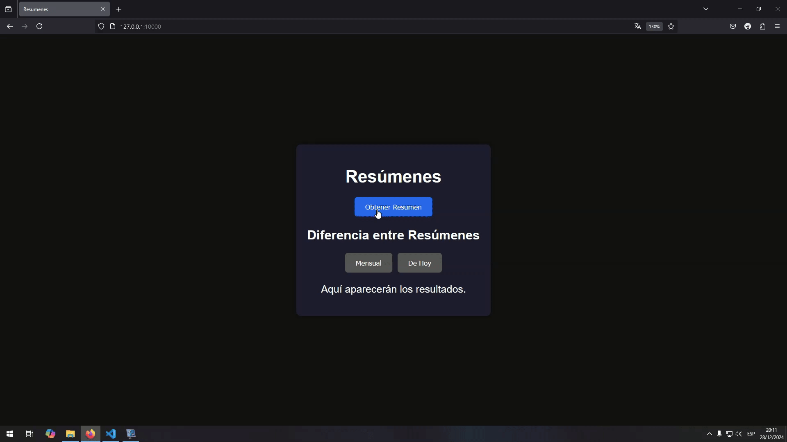

# Proyecto: Sistema de Automatización y API REST para Resúmenes

## Descripción General
Este proyecto es una combinación de automatización de tareas y una API REST que permite generar y obtener un resumen financiero a partir de un sistema externo. Utiliza herramientas modernas como Flask, Selenium y Pandas para ofrecer una solución robusta y escalable.

## Características Principales
- **Automatización Web**: Navega automáticamente por el sistema externo, ingresa credenciales, descarga reportes y procesa la información.
- **API REST**: Ofrece endpoints para interactuar con la automatización y obtener resúmenes financieros.
- **Procesamiento de Datos**: Analiza reportes descargados utilizando Pandas y extrae información relevante.
- **Frontend Interactivo**: Interfaz web diseñada para interactuar con los endpoints de la API. Está optimizada para dispositivos móviles, 
  permitiendo al usuario acceder fácilmente desde su celular y obtener los resúmenes financieros con facilidad




## Estructura del Proyecto
```
autogs/
├── abs_path.py
├── application/
│   ├── configuration/
│   │   └── firebase_config.py
│   ├── controller/
│   │   ├── APIREST/
│   │   │   └── SummaryApi.py
│   ├── automation/
│   │   ├── date_setter/
│   │   │   ├── DateSetter.py 
│   │   │   ├── DateSetterLastMonth.py
│   │   │   ├── DateSetterLastMonthToday.py
│   │   │   └── DateSetterCurrentMonth.py
│   │   ├── FileDownloader.py
│   │   ├── Login.py
│   │   ├── Report.py
│   │   ├── Summary.py
│   │   └── WebDriverManager.py
│   ├── pandas/
│   │   └── ExcelReader.py
│   ├── service/
│   │   └── SummaryService.py
│   ├── persistence/
│   │   └── SummaryDAO.py
├── front/
│   ├── static/
│   │   ├── css/
│   │   │   └── style.css           
│   │   ├── js/
│   │   │   └── scripts.css  
│   │   ├── assets/
│   ├── templates/
│   │   │   └── index.html
├── Dockerfile.py
├── Procfile.py
└── requirements.txt
```


### Descripción de Carpetas y Archivos
- **configuration/**: Configuracion de la base de datos.
  - `firebase_config.py`: Encargado de leer las credenciales para inicializar la app de firebase y crear una instancia de firestore.  
- **controller/**: Implementa la API REST con Flask.
  - `SummaryApi.py`: Define los endpoints `/diferenciaResumenes`,  `/diferenciaResumenesHoy` y `/obtenerResumen` para interactuar con el servicio.
- **automation/**: Contiene los scripts de automatización basados en Selenium.
  - `WebDriverManager.py`: Trabaja como Orquestador usando el resto de las clases. Configura el WebDriver, navega y descarga reportes.
  - `DateSetter.py`: Establece rangos de fechas en formularios dependiendo lo requerido.
  - `Login.py`: Realiza el inicio de sesión en el sistema externo.
  - `Report.py`: Navega al reporte deseado dentro del sistema.
  - `FileDownloader.py`: Descarga el archivo del reporte y verifica su existencia.
  - `Summary.py`: Define la lógica del negocio. Orquesta los pasos de automatización y procesamiento de datos. Almacena los datos de valor.  
- **pandas/**: Procesa los datos del reporte descargado.
  - `ExcelReader.py`: Lee y analiza el archivo descargado para extraer el total. Se maneja de forma eficiente borrando al anterior 
    para ahorrar espacio en memoria y recursos.
- **service/**: Se encarga de interactuar con el modelo y la capa de persistencia.
  - `SummaryService.py`: Interviene como intermediario entre el negocio y la persistencia de datos para asegurar consistencia en los datos.
- **persistencia/**: Se encarga de interactuar con la base de datos (firestore).
  - `SummaryDAO.py`: Crea y actualiza instancias de Summary con lo suficiente para asegurar su correcto funcionamiento.
- **abs_path.py**: Define rutas absolutas para asegura que el archivo se almacene correctamente.
- **requeriments.txt**: Lista de dependencias necesarias para ejecutar el proyecto.
- **Dockerfile**: Archivo de Docker preparado para que todo funcione correctamente en produccion. 
- **front/**: Un mini front para interactuar con la aplicación. Hecho solo con CSS, HTML y JavaScript para que la app sea lo menos pesado y eficiente.

## Tecnologías Utilizadas
- **Flask**: Framework para construir la API REST.
- **Selenium**: Para la automatización de navegación y descargas.
- **Pandas**: Para el análisis y procesamiento de datos.
- **dotenv y decouple**: Manejo de configuraciones sensibles como credenciales y variables de entorno.

## Requisitos Previos
1. **Python 3.12+**
2. Instalación de dependencias:
   ```bash
   pip install -r requirements.txt
   ```
3. **Google Chrome** y su correspondiente **ChromeDriver**.
4. Configurar un archivo `.env` con las credenciales:
   ```env
   DB_USER=usuario
   DB_PASSWORD=contraseña
   DB_KEY=key de firebase (tiene que estar en una sola linea)
   ```

## Cómo Ejecutar el Proyecto
1. Clona el repositorio y navega al directorio principal:
   ```bash
   git clone <url_repositorio>
   cd carpeta_raiz
   ```
2. Instala las dependencias:
   ```bash
   pip install -r requirements.txt
   ```
3. Ejecuta la API REST:
   ```bash
   python -m application.controller.APIREST.SummaryApi
   ```
4. Accede a los endpoints:
   - GET `/diferenciaResumenes`: Devuelve la diferencia entre el resumen total del mes anterior y el resumen del dia actual. 
     -- ``Ejemplo``: Suponiendo que hoy es 26/12/2024, entonces la resta es entre el resumen del 30/11/2024 y del 26/12/2024 
   - GET `/diferenciaResumenesHoy`: Devuelve la diferencia entre el resumen de hoy pero un mes atras y el resumen del dia actual.
     -- ``Ejemplo``: La resta es entre el resumen del 26/11/2024 y del 26/12/2024
   - GET `/obtenerResumen`: Devuelve el resumen del dia actual en formato JSON.

## Ventajas del Proyecto
- **Escalabilidad**: Diseñado con una arquitectura modular para agregar nuevas funcionalidades.
- **Automatización Eficiente**: Reduce significativamente el tiempo empleado en tareas repetitivas, aumentando la productividad.
- **Fácil Integración**: Puede ser integrado en otros sistemas mediante la API REST.
- **Eficiencia**: Optimizado para consumir únicamente los recursos necesarios, garantizando un desempeño eficiente.
- **Consistencia de Datos**: Utiliza Firestore como base de datos, asegurando la consistencia, alta disponibilidad y escalabilidad de los datos en tiempo real.

## Deploy
- El proyecto ya esta listo para el deploy a traves del Dockerfile. 
Especificamente listo para Render ya que esta escuchando en el puerto 10000, pero podes cambiarlo segun tus necesidades.

## Contacto
Cualquier consulta o mejora, no dudes en contactarme: matteogiuffrah40@gmail.com


